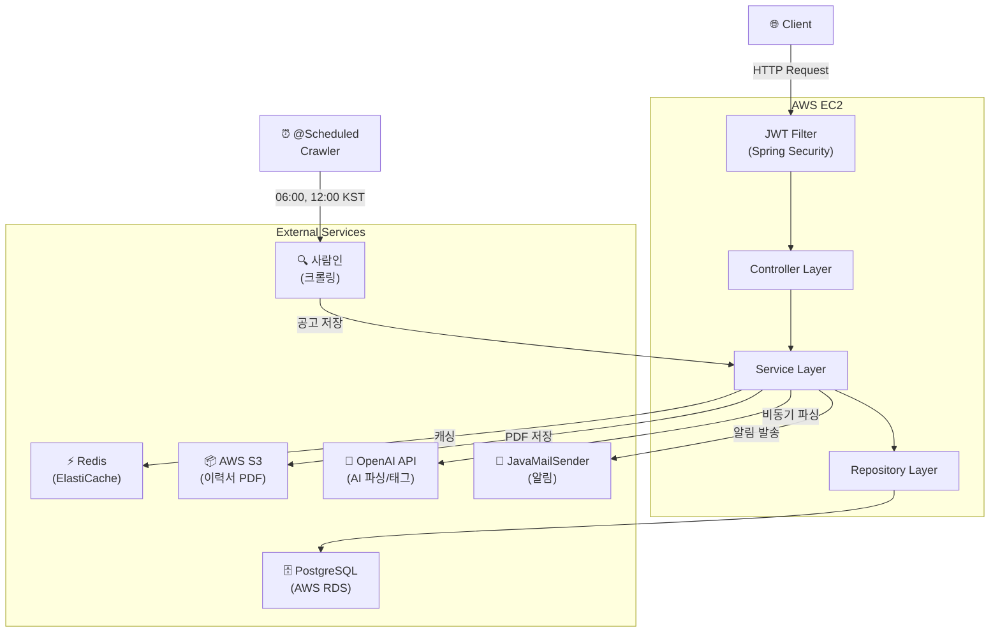
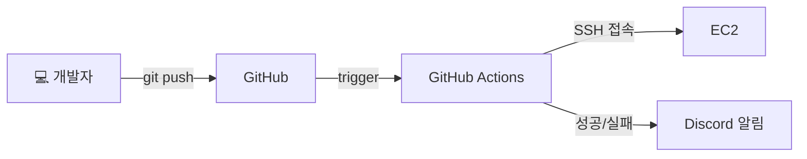
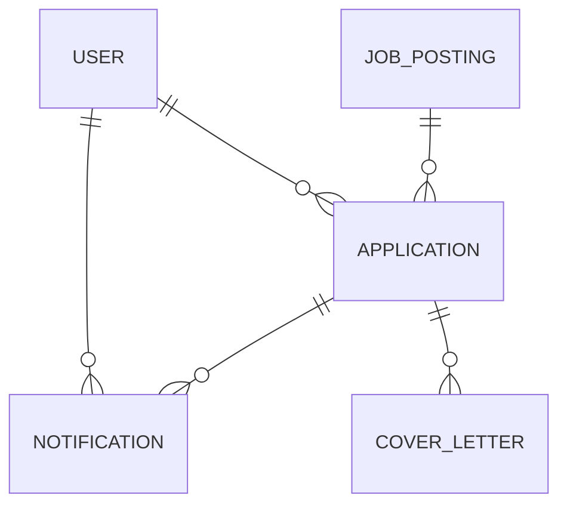

# HireFlow 🎯
> AI 기반 채용 공고 매칭 및 지원 현황 관리 비서

&nbsp;
## 프로젝트 소개

취업 준비생이 채용 공고를 직접 찾아다니며 스프레드시트로 관리하는 불편함을 해소하기 위해 만든 서비스입니다.  
공고 크롤링 → AI 태그 추출 → 내 기술스택 기반 매칭 → 지원 현황 관리 → 마감/면접 알림까지 한 곳에서 처리합니다.

&nbsp;
## 주요 기능

- **공고 자동 수집** : Jsoup + @Scheduled로 주기적 크롤링 (사람인)
- **AI 태그 추출** : OpenAI API로 공고에서 기술스택 자동 추출
- **공고 추천** : 내 기술스택 기반 Top 3 매칭 (Redis 캐싱)
- **이력서 파싱** : PDF 업로드 → AI 파싱 → 기술스택 자동 업데이트 (비동기)
- **지원 현황 관리** : 지원 등록 / 상태 변경 / 메모 / 면접 날짜 관리
- **알림** : 마감 D-3 / 면접 D-1 / 파싱 완료 이메일 알림 (JavaMailSender)
- **AI 자소서 코치** : 자소서 작성 초안 생성 / AI 채점 (strengths/improvements) / AI 첨삭

&nbsp;
## 기술 스택


| 분류 | 기술 |
|---|---|
| Backend | Spring Boot 3.x, Spring Security, JWT |
| Database | PostgreSQL, JPA/Hibernate |
| Cache | Redis |
| Crawling | Jsoup, @Scheduled |
| AI | OpenAI API |
| File | AWS S3 |
| Notify | JavaMailSender |
| Infra | Docker, AWS EC2, GitHub Actions |
| Docs | Swagger (springdoc-openapi) |

&nbsp;
## 기술 선택 이유

| 기술 | 선택 이유                                                                                                                                                     |
|---|-----------------------------------------------------------------------------------------------------------------------------------------------------------|
| Spring Boot | 풍부한 생태계와 자동 설정으로 빠른 개발 가능. DI/AOP 기반 구조로 관심사 분리와 테스트 용이성 확보                                                                                               |
| PostgreSQL | 오픈소스 관계형 DB. JSON 컬럼, 전문 검색 등 확장성 우수. RDS로 관리 부담 최소화                                                                                                      |
| Redis | 인메모리 기반 빠른 조회 + TTL 자동 만료. 공고 목록/추천 API에 @Cacheable 적용 (TTL 10분). EC2-RDS 동일 VPC 구성으로 절대적 응답시간 차이는 작으나 DB 커넥션 풀 절약 및 쿼리 실행 비용 감소 목적. 데이터 규모 증가 시 효과 극대화. refreshToken 화이트리스트 저장으로 로그아웃 구현. JWT의 stateless 한계를 Redis로 보완 |
| JWT | Stateless 인증으로 서버 확장성 확보. 별도 세션 저장소 불필요                                                                                                                   |
| Jsoup | 경량 HTML 파싱 라이브러리. JS 렌더링 없는 사람인 크롤링에 적합                                                                                                                   |
| @Scheduled | 별도 스케줄러 서버 없이 Spring 내에서 크롤링 주기 관리 가능                                                                                                                     |
| ApplicationEventPublisher | 이력서 파싱을 비동기로 분리해 API 응답 지연 방지                                                                                                                             |
| AWS S3 | 이력서 PDF 파일 저장에 적합한 오브젝트 스토리지. 직접 URL 접근 가능                                                                                                                |
| Docker | 로컬/배포 환경 일관성 확보. docker-compose로 의존 서비스 한번에 실행                                                                                                            |
| GitHub Actions | 코드 push 시 자동 빌드/배포. 별도 CI 서버 불필요                                                                                                                          |

> 단일 서버 + 단일 서비스 구조라 Kubernetes/ArgoCD는 과한 선택.  
> GitHub Actions + systemd 조합으로 충분한 자동화 달성.

&nbsp;
## 아키텍처




&nbsp;
## ERD



| 테이블 | 설명 |
|---|---|
| users | 회원 정보, 기술스택, 이력서 파싱 상태 |
| job_postings | 크롤링/직접등록 공고, AI 추출 태그 |
| applications | 지원 현황, 상태, 면접 날짜 |
| cover_letters | 자소서 작성 및 AI 첨삭 |
| notifications | 마감/면접/파싱 완료 알림 |

&nbsp;
## 패키지 구조

```
com.hireflow.hireflow
├── domain
│   ├── auth
│   ├── user
│   ├── jobposting
│   ├── application
│   ├── notification
│   └── coverletter
├── global
│   ├── common
│   ├── config
│   ├── exception
│   └── security
└── infra
    ├── ai
    ├── crawler
    ├── mail
    └── s3
```

&nbsp;
## API 명세

- **배포 주소** : http://43.202.137.232:8080
- **Swagger** : http://43.202.137.232:8080/swagger-ui/index.html

| 분류 | 엔드포인트 수 |
|---|---------|
| Auth | 4       |
| User | 5       |
| Actuator | 1       |
| JobPosting | 6       |
| Application | 7       |
| CoverLetter | 7       |
| Notification | 3       |

&nbsp;
## 로컬 실행 방법

```bash
# 1. 아래 환경변수를 IntelliJ Run Configuration 또는 .env에 설정
DB_HOST, DB_PORT, DB_NAME, DB_USERNAME, DB_PASSWORD
JWT_SECRET
OPENAI_API_KEY
AWS_ACCESS_KEY, AWS_SECRET_KEY, S3_BUCKET
MAIL_USERNAME, MAIL_PASSWORD
REDIS_HOST

# 2. Docker로 로컬 DB/Redis 실행
docker-compose up -d

# 3. 앱 실행
./gradlew bootRun
```

&nbsp;
## 개발 기간 및 일정

| 기간 | 내용 |
|---|---|
| 1주차 | 기반 구축 (DB, Entity, JWT, 크롤러, 공고 API, Redis) |
| 2주차 | 핵심 기능 (지원 관리, S3, AI 파싱, 추천, 알림) |
| 3주차 | 배포 (Docker, EC2, CI/CD, Swagger, README) |

&nbsp;
## 트러블슈팅

### @Lob + PostgreSQL oid 타입 매핑
- **원인**: Hibernate + PostgreSQL 조합에서 `@Lob + String`이 TEXT가 아닌 oid(대용량 객체 포인터)로 매핑됨
- **해결**: `@Lob` 제거 후 `@Column(columnDefinition = "TEXT")`로 타입 직접 지정

### Jsoup CSS Selector 불일치
- **증상**: 크롤링 HTML은 정상 수신되나 파싱 결과 0건
- **원인**: 사람인 HTML 구조 변경으로 selector `.item_recruit` 불일치
- **해결**: F12로 실제 구조 확인 후 `li.item.lookup`, `span.corp`으로 수정

### JWT 필터 예외로 permitAll 경로 403
- **원인**: `JwtAuthenticationFilter`에 try-catch 없어 토큰 없는 요청에서 필터 중단
- **해결**: `doFilterInternal()` 전체 try-catch 처리, 예외 발생해도 다음 필터로 전달

### Redis LocalDate 직렬화 오류
- **원인**: `GenericJackson2JsonRedisSerializer`에 JavaTimeModule 등록한 ObjectMapper 미주입
- **해결**: `new GenericJackson2JsonRedisSerializer(objectMapper)`로 직접 전달

### spring-cloud-aws credentials 무시 문제
- **증상**: 이력서 PDF 업로드 시 403 에러 — IAM 콘솔에서 Access Key `Never used` 확인
- **원인**: spring-cloud-aws가 yml 설정을 무시하고 자체 credential chain 탐색. `AWS_ACCESS_KEY`와 SDK 표준 변수명 `AWS_ACCESS_KEY_ID` 불일치
- **해결**: `S3Config`로 `S3Client` 직접 빈 등록, `AwsBasicCredentials.create()`로 강제 주입

### ElastiCache 보안 그룹 미설정으로 Redis 연결 실패
- **증상**: `GET /api/job-postings` 호출 시 500 에러
- **원인**: ElastiCache에 보안 그룹이 없어 EC2 → Redis 6379 포트 접근 불가
- **원인 2**: 전송 암호화 모드가 `필수 항목`으로 설정되어 TLS 없는 연결 차단
- **해결**: EC2 보안 그룹을 ElastiCache에 연결 + 전송 암호화 모드를 `기본 설정`으로 변경

### EC2 배포 후 앱 프로세스가 SSH 세션 종료 시 함께 종료
- **증상**: CI/CD 배포 후 앱이 죽어서 Swagger 접근 불가
- **원인**: appleboy/ssh-action이 세션 종료 시 SIGTERM을 자식 프로세스에 전달
- **시도**: nohup / disown / setsid 모두 실패
- **해결**: systemd 서비스로 등록 (`hireflow.service`) — SSH 세션과 완전히 독립적으로 동작

### EC2 타임존 미설정으로 크롤러 실행 시간 불일치
- **원인**: EC2 기본 타임존이 UTC라 `cron = "0 0 9 * * *"`이 KST 18:00에 실행됨
- **해결**: `sudo timedatectl set-timezone Asia/Seoul` 후 systemctl restart

### @Transactional 누락으로 스케줄러 Lazy Loading 실패
- **증상**: 면접 D-1 알림 스케줄러 실행 시 `HibernateProxy.getEmail()` 에러, 메일 미발송
- **원인**: `@Scheduled` 메서드는 기본적으로 트랜잭션이 없어 Lazy Loading 시도 시 DB 연결 불가
- **해결**: `sendDeadlineReminders()`, `sendInterviewReminders()`에 `@Transactional` 추가

### AI 첨삭 결과가 원본 content를 덮어쓰는 문제
- **증상**: 첨삭 API 호출 후 aiFeedback이 null, content가 변경됨
- **원인**: updateFeedback()이 this.aiFeedback 대신 this.content를 수정하도록 구현됨
- **해결**: this.content → this.aiFeedback으로 수정, 원본 보존 + 첨삭본 분리 저장

&nbsp;
## Git Convention

### Commit Message

| Type | 사용 시점 | 예시 |
|---|---|---|
| feat | 새로운 기능 추가 | `feat: add user login` |
| fix | 버그 수정 | `fix: resolve password validation error` |
| docs | 문서 수정 | `docs: update README` |
| style | 코드 스타일 변경 | `style: apply code formatting` |
| refactor | 코드 리팩토링 | `refactor: improve auth logic` |
| test | 테스트 코드 추가/수정 | `test: add login unit test` |
| perf | 성능 개선 | `perf: optimize DB query` |
| build | 빌드 파일 수정 | `build: update gradle dependencies` |
| ci | CI/CD 설정 수정 | `ci: add GitHub Actions workflow` |
| chore | 기타 작업 | `chore: update dependencies` |
| add | 파일/라이브러리 추가 | `add: add swagger dependency` |

### Branch

| Branch | 설명 |
|---|---|
| `main` | 배포 브랜치 |
| `develop` | 개발 통합 브랜치 |
| `feat/기능명` | 기능 개발 브랜치 |
| `fix/버그명` | 버그 수정 브랜치 |

&nbsp;
---

> 👩‍💻 개발자 : 이주희 · [GitHub](https://github.com/juheehee) · [Blog](https://velog.io/@juhuihee/posts)
